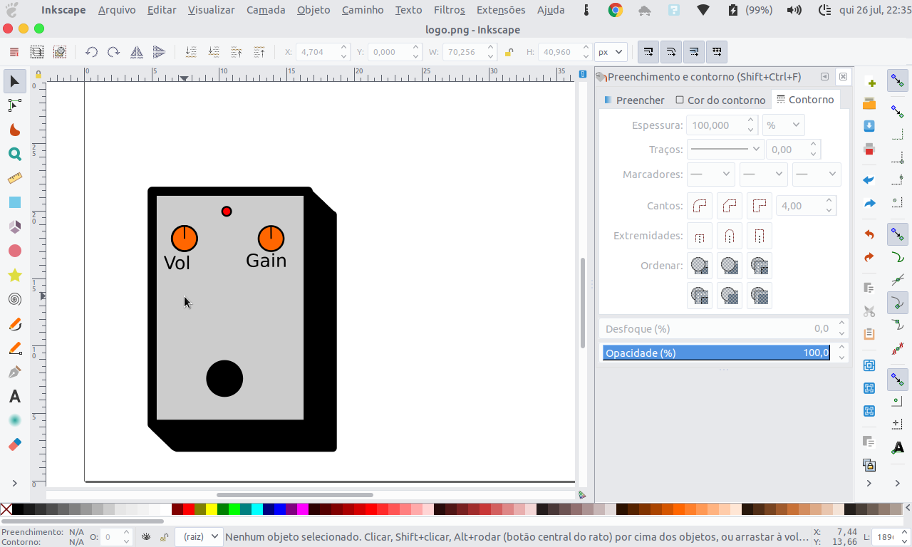

## Scripts to match the color of plank with the background, to simulate the blur, but is lighweight.

## DEPENDS 
	Python-pip
	Python3 (Of course, genius)
	Dconf
	Just a little pacience (just kiddin')

## BEFORE INSTALL
Works with MATE, Gnome, Cinnamon, Patheon Shell. Stay tunned! If you want it to work on your favorite DE, consider contribute with the code! 

## MANUAL
To install, run the "installer.sh". The first time, you will need to run the "main.sh" to setup all te variables and configuration, after you can run "daemon.sh", this script will run just like a daemon, watching the change of the wallpaper, to automate the process
In case of troubles, or any doubts just send me a e-mail to "matricci2011@hotmail.com".
		
## Known Issues
Files with spaces will not work!

The daemon script isn't wonderfull.

The installer is buggy

## Screenshot

