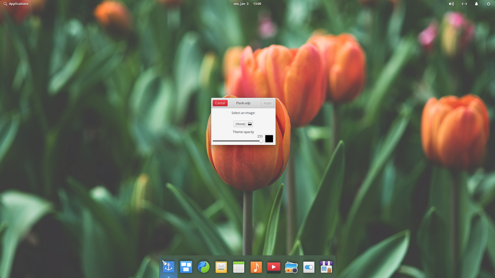
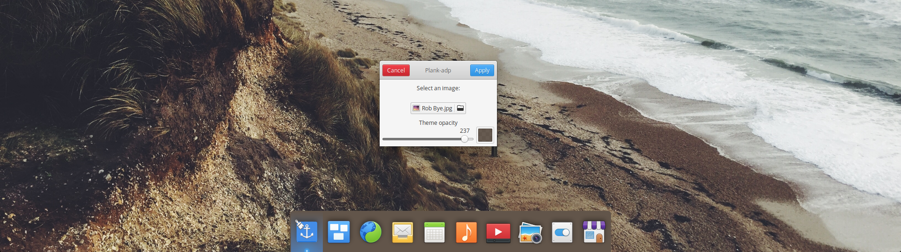

# Plank-adp
Script to match the color of the plank with the background.

## How does it work?
by cropping the image in the area that the dock will sit, and getting the average color, it roughly emulates some kind of a blur. It's not a real blur!

## DEPENDS 
	Python-pip
	Python3 (Of course, genius)
	Dconf-tools
	Python Gobject
	Python Pillow
## How to install 

Inside the `scripts` folder, run the `installer.sh`.

## Screenshots

